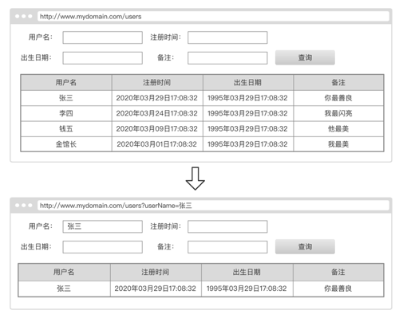

# 上机题 (40分钟内完成)

## 原型：


## 描述
1. 页面输入相应查询条件可得到相应结果；
2. 页面刷新后表格数据不变，依然为刷新前的结果；
3. 请使用React（可使用ant-design组件库）编码实现一个表格组件满足原型要求；
4. 请从master创建自己的分支后提交，分支名格式为姓名的拼音，如：zhangsan；
5. 除满足原型需求外，若时间充裕，尽可能完善这个组件以满足额外的隐藏需求、完善API说明等，以高质量组件为目标。

## api

```bash
http://10.2.3.103:55555/users
```

## 